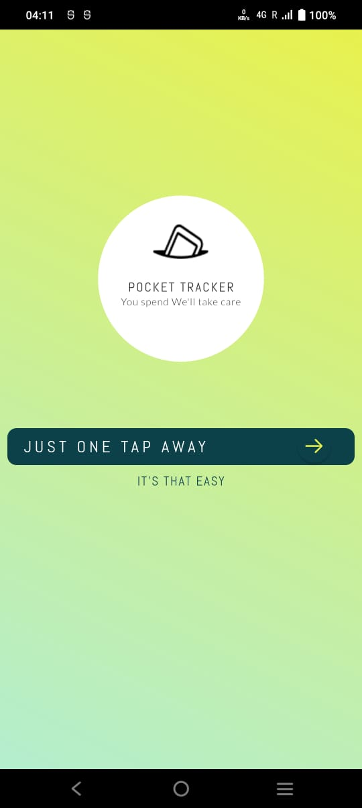
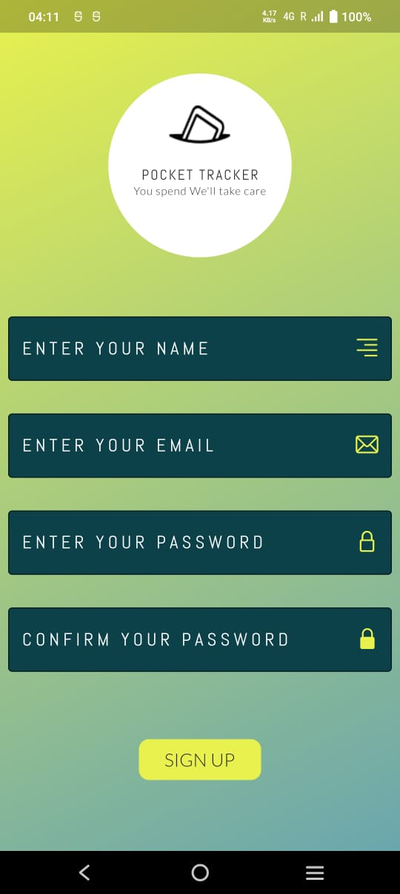
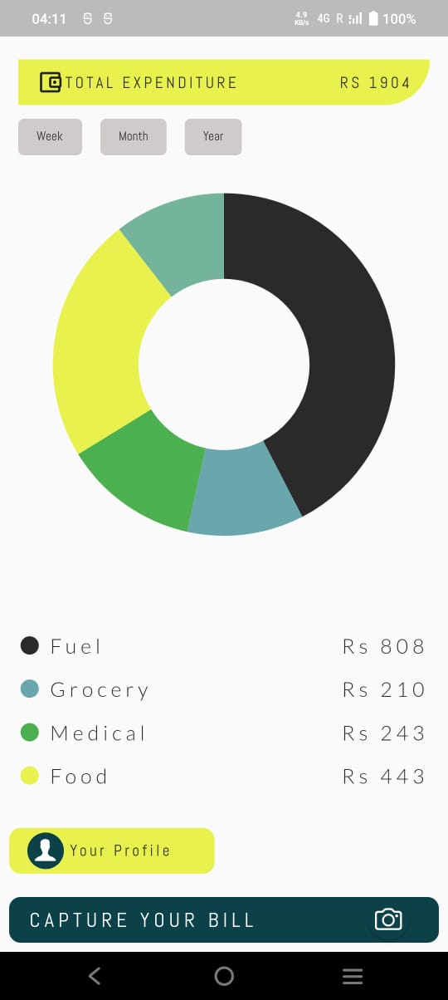
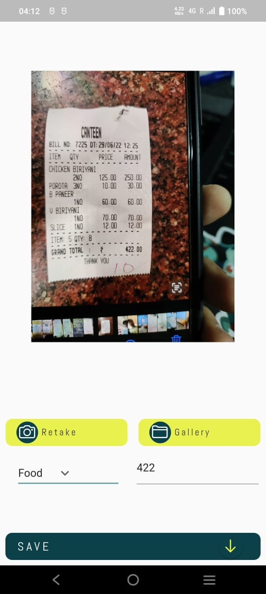
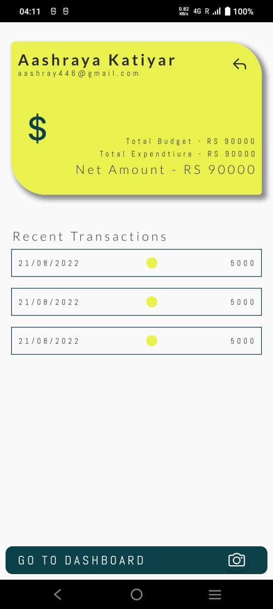

# Pocket Tracker

This is our project for Hackathon [Hack@Arch](https://hackatarch.devfolio.co/) 2021, Conducted by GECT.

---

## Description
The main goal of the app is to help you to efficiently keep track of your everyday expenses.
The app has a very intuitive and easy to understand User Interface.
Upon opening the app, the user has to click a photo of his receipt. Our app's algorithm will extract the total amount from the receipt and ask the user to tag it with a label like grocery, medical, food, fuel, apparel etc.
The app shows a donut chart to the user to show him how much money he has spent category wise and will also give an alert when the budget is about to be over.
Additionally, the app also has a page for recent bills, where the user can view his past bills, along with the timestamp and its label, saving the user from the hassle of misplacing the receipt.

---

## Screenshots

<!--  -->

### Checkout our Devfolio Submissions at: [Pocket Tracker](https://devfolio.co/projects/pocket-tracker-1ade)